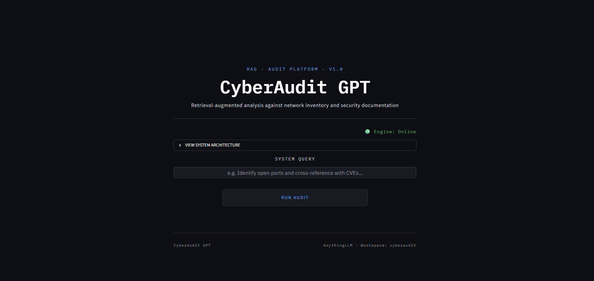
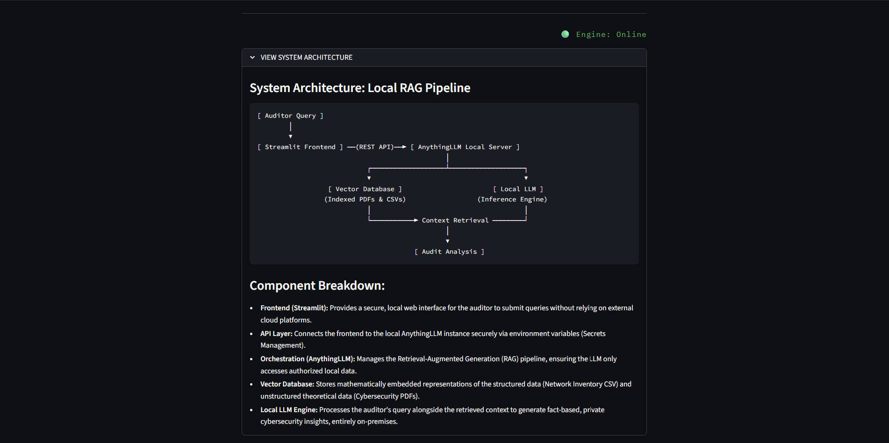
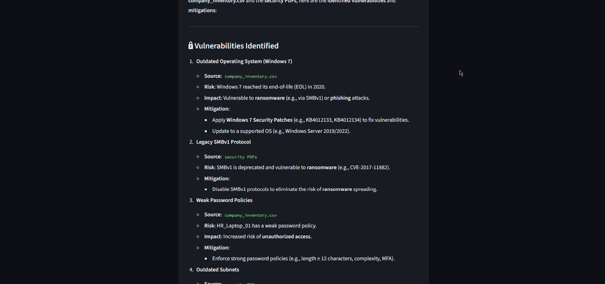
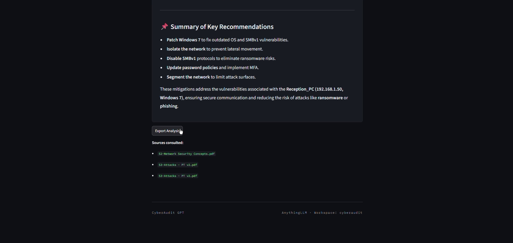

# CyberAudit GPT - Local RAG Security Audit Assistant


## Project Overview

A local, privacy-first cybersecurity audit tool that uses Retrieval-Augmented Generation (RAG) to cross-reference network inventory data against security documentation, entirely on-premises, with no data leaving the machine.

The unstructured data source was built from the professor's own lecture slides for the Network and Computer Security course, material I thought would be interesting to repurpose for this project. The structured data was a fictitious company's network inventory (CSV with devices, IPs, open ports, vulnerabilities, and criticality levels). The lecture content was used to help answer questions about the CSV data, allowing a company employee to interact with a chatbot to clarify doubts and cross-check vulnerabilities based on their own network data.

Built with Streamlit for the interface, AnythingLLM for RAG orchestration, and Ollama (qwen3-nothink) for local LLM inference, with LanceDB as the vector store. 

---

## What's Inside

| Section | Description |
|---|---|
| **Knowledge Base** | Network & Computer Security lecture material, used as unstructured grounding documentation |
| **Structured Inventory** | Fictional company network inventory (CSV) — devices, IPs, open ports, vulnerabilities, criticality |
| **RAG Orchestration** | AnythingLLM handles ingestion, chunking, embedding, and retrieval over both sources |
| **Local Inference** | Ollama (`qwen3-nothink`) generates grounded answers entirely on-device |
| **Interactive Dashboard** | Streamlit UI for natural-language Q&A with source visibility |

---

## Key Findings & Limitations

- **Grounded Answers:** Cross-referencing structured inventory data with unstructured documentation reduces hallucination compared to free-form LLM queries.
- **Knowledge Base Scope:** Answer quality is bounded by the documentation ingested, questions outside the lecture material or inventory scope will be poorly grounded.
- **No Cloud Dependency:** Running fully local (Ollama + AnythingLLM) trades off some raw model quality for complete data privacy, which is the core design goal.

---

## Tech Stack

- **RAG Orchestration:** AnythingLLM
- **Local LLM Inference:** Ollama (`qwen3-nothink`)
- **Vector Store:** LanceDB (via AnythingLLM)
- **Dashboard Front-end:** Streamlit
- **Language:** Python


---

## Repository Structure

| Path | Description |
|---|---|
| **app.py** | Main entry point for the Streamlit application |
| **requirements.txt** | Python dependencies |
| **.env** | Environment variables (API key, AnythingLLM URL) — not committed |

---

## How to Run the Project

**1. Setup Environment & Dependencies:**

```bash
git clone https://github.com/tomassilva5/CyberAudit-GPT.git
cd CyberAudit-GPT
python -m venv venv
source venv/bin/activate  # Windows: venv\Scripts\activate
pip install -r requirements.txt
```

**2. Setup Environment Variables:**

Create a `.env` file in the root directory:

```env
API_KEY=your_api_key_here
ANYTHING_LLM_BASE_URL=http://localhost:3001
```

**3. Prerequisites:**

Make sure the following are installed and running before starting the app:
- [Ollama](https://ollama.com) with the `qwen3-nothink` model pulled
- [AnythingLLM](https://anythingllm.com) desktop app, with your workspace and API key set up

**4. Run the Application:**

Start the interactive CyberAudit GPT web interface:

```bash
streamlit run app.py
```

---

## Screenshots Gallery

These images are available locally in the project and are kept out of the repository via git ignore.

### 1. Main Interface

A clean entry point for the audit assistant, where the user can start interacting with the system.



### 2. System Architecture

A visual overview of how the local RAG pipeline connects the interface, the knowledge base, and the model.



### 3. Response to a query

An example of the system answering a cybersecurity question with a grounded response.



### 4. Sources and Export Analysis

The interface also shows the retrieved sources and the option to export the analysis result.



---

*© 2026 CyberAudit GPT | Developed by Tomás Silva*